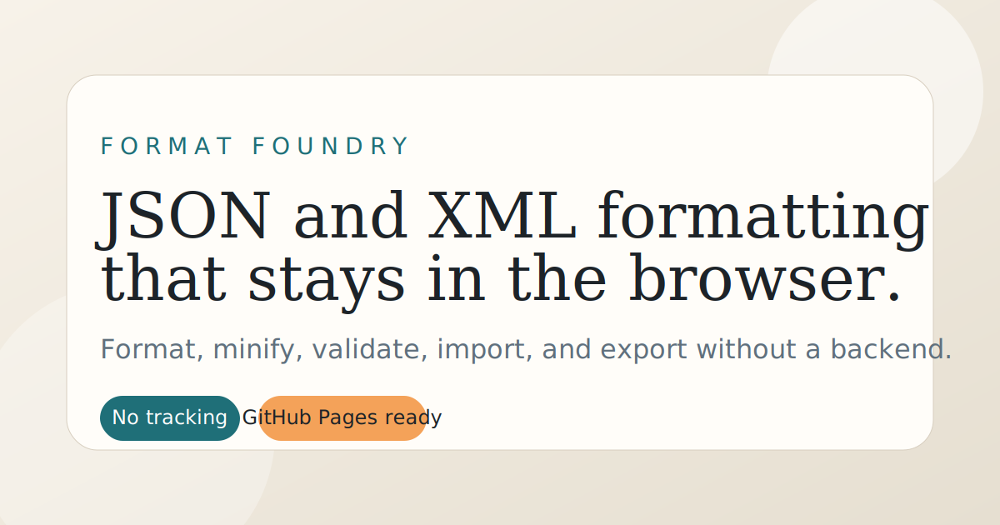

# Format JSON & XML

Local-first JSON and XML formatter for cleaning up structured data in the browser with the Northline visual system.

## Live Demo
Deployable as a static GitHub Pages app with relative asset paths.



## Key Features
- Format, minify, and validate JSON and XML
- Import, export, copy, and sample-loading workflows
- Keyboard shortcuts for common formatting actions
- Drag-and-drop file support
- Accessibility-focused status messaging and tab behavior

## Tech Stack
- Vite
- Vanilla JavaScript
- Static GitHub Pages-friendly build output

## Setup / Run Locally
```bash
npm install
npm run dev
```

## Tests
```bash
npm run lint
npm run test
```

## Deployment Notes
- The app uses `base: './'`, so it can be hosted safely under a GitHub Pages project subpath.
- Keep shared assets relative so the same build works locally and when deployed.

## Project Layout
- `src/` application code
- `public/` static assets and manifest
- `.github/workflows/` CI and Pages deployment workflows

## Privacy / Notes
- All parsing and formatting happen in the browser.
- The public product name is `Format JSON & XML`, and the repo slug target is `format-json-xml`.
